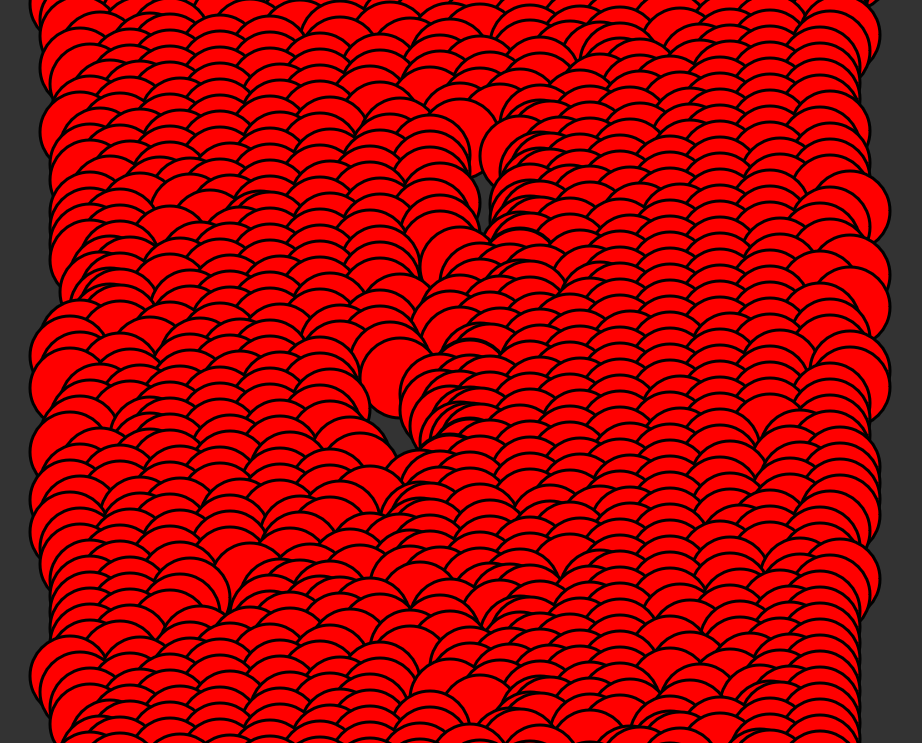

# react svg proof of concept

For now this is just testing how well react works with SVG.

The intersting part is App.js which contains SVG components and App.css which
defines the styling for SVG. Hover and mouse events are supported.

Work in progress stuff!